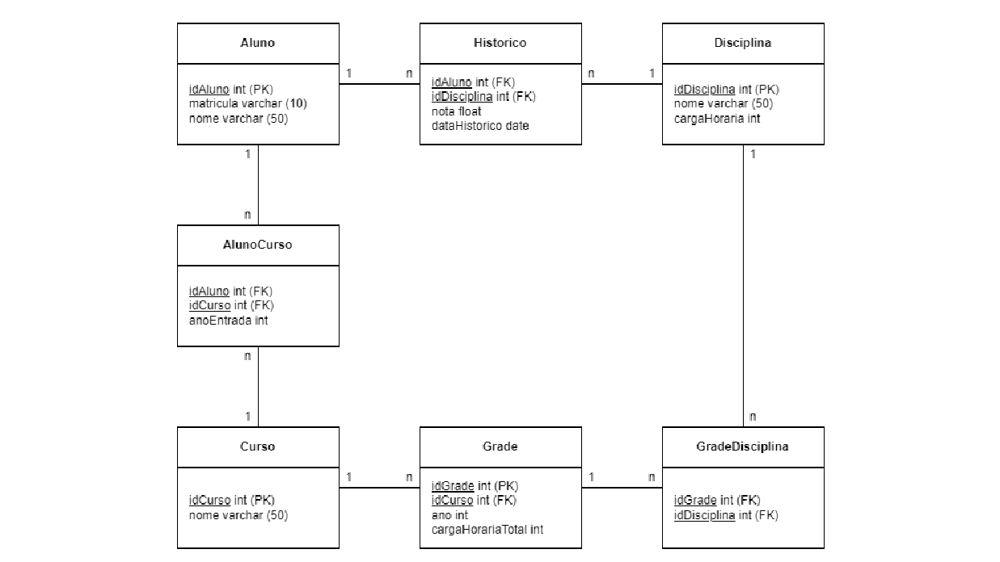

# Modelo-Relacional-referente-ao-estudo-de-caso-de-uma-faculdade

 

Com base no Modelo Relacional dado e utilizando a Structured Query Language (SQL), no MySQL Workbench, implemente o que se pede.
OBS.: O código para povoar o banco de dados já veio pronto

1. Implemente um Banco de Dados chamado “Faculdade”. Após, implemente as tabelas, conforme o Modelo Relacional dado, observando as chaves primárias e as chaves estrangeiras. Todos os campos, de todas as tabelas, não podem ser nulos (not null)
2. Implemente uma consulta para listar o quantitativo de cursos existentes
3. Implemente uma consulta para listar o nome das disciplinas existentes
4. Implemente uma consulta para listar o nome de todos os cursos e o nome de seus respectivos alunos. A listagem deve ser mostrada em ordem decrescente pelo nome dos cursos
5. Implemente uma consulta para listar o nome das disciplinas e a média das notas das disciplinas em todos os cursos. Para isso, utilize o comando group by
6. Implemente uma consulta para listar o nome de todos os cursos e a quantidade de alunos em cada curso. Para isso, utilize os comandos join e group by
